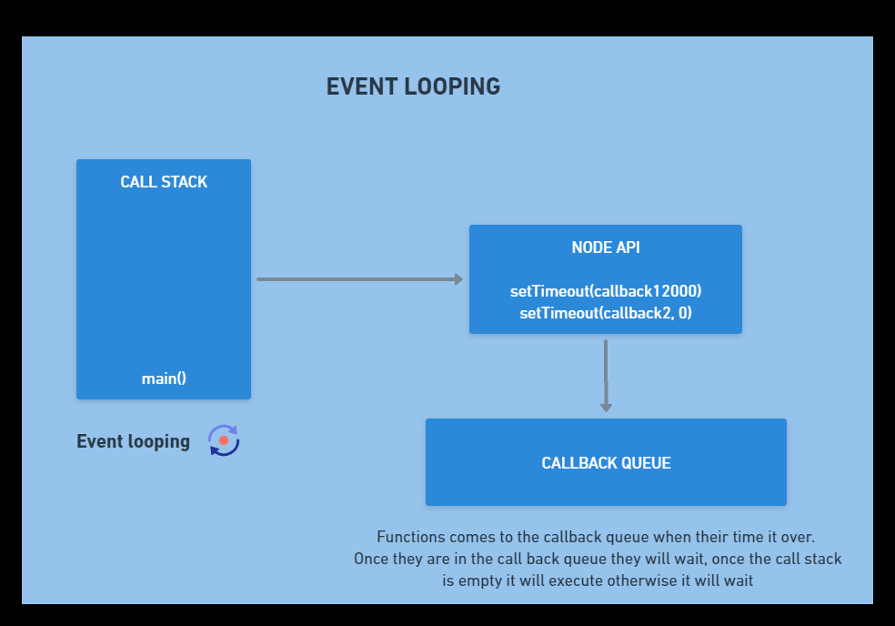

# EVENT LOOP



#### MECHANISM:

1. Push main onto the call stack.
2. Push console.log onto the call stack. This then runs right there and gets popped.
3. Push SetTimeout(2000) onto the stack.
4. SetTimeout(2000) is a Node API, when we call it we register the event-callback pair. The event will wait 2 seconds (2000ms) then callback function will be called. SetTimeout is an asynchronous function. Event is the callback function wil be excuted after 2000ms.
5. After registering it in the API SetTimeout(2000) gets popped from the call stack.
6. Similarly, second SetTimeout(0) is registered and popped from the call stack. We now have 2 APIs waiting to execute.
7. After waiting for 0 seconds SetTimeout(0) gets moved to the call back queue and same thing happens with SetTimeout(2000).
8. In callback queue, the functions wait for the call stack to be empty because only one statement can execute at a time. This is taken care of by the event loop.
9. The last console.log runs, and the main() gets popped from the call stack.
10. The event loops sees that the call stack is empty and the call back queue is not empty. So it moves the callbacks (in FIFO order) to the call stack for exection.

```
console.log("Start")
SetTimeout(callback1,2000);
SetTimeout(callback2, 0);
console.log("End")
```

#### EVENT LOOPING FACTS

**Q. How to counter multi-threading situation?**

Event looping is a way to ditch multi-threading.

Synchronous: goes directly to the call stack.

Asynchronous: gors to the Node API, then to the callback queue and finally to the call stack.

#### FACTS

* Node.js does not use more than one core in a multicore processor.
* Node.js is not suitable for CPU intensive applications for example MP3 compression, foriour transfrom or 3D rendereing.
