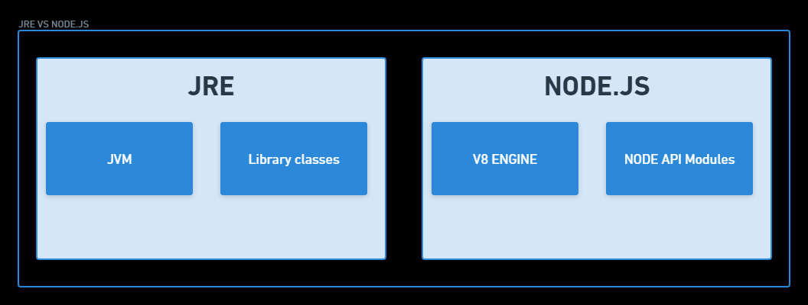

# NODE JS

Nodejs is a JavaScript Runtime. We create a server using Nodejs to host the website that we have created.

* Node.js is javascript working on the server side.
* Google chrome has v8 engine to understand JS on the client side. Similarly, node.js uses v8 engine on the server side.
* Node.js uses v8 feature added for example v8 at client side cannot access or perform file handeling while node.js can do it.
* v8 is written in C++. v8 converts JS into machine code, it is a compiler.
* Node.js is JavaScript runtime built on chrome v8 JavaScript engine.
* Node.js uses an event-driven, non-blocking input output model that makes it efficent and lightweight.
* Input-Output refers to reading-witing local files or making http request to an API.
* Node.js is a single threaded application that actually leverages the multi-threaded behaviour of another processes for example database. The mechanism to leverage is event loop.

# NOSQL DATABASE

Normal structural databases have entities that we define. We have some entities like Salary, Age, Code but we don't know the name, in short we have some info and not all the information. Here we use structured database and entities as a name-value pair.

NoSQL database is used for unstructued data.
