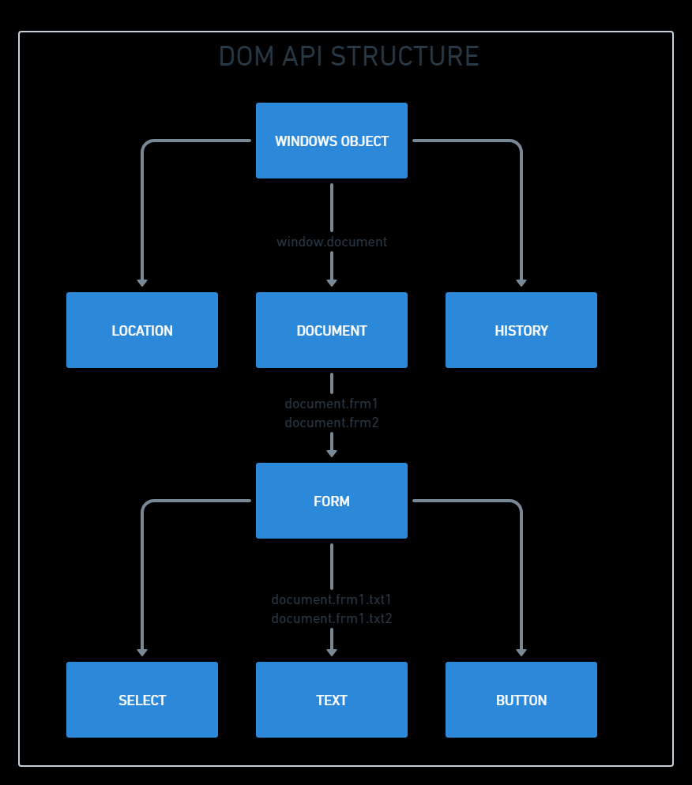

DOM 

API is  a medium through which two systems communicate with each other

here two objects are making a connection with each other, to do that we are using DOM API

# LOCATION OBJECT

Location objects supports these properties:

1. Host main
2. Port
3. Protocol
4. href (shows the whole location - complete url)
5. Search
6. Assign (this is a function - this can chnage the url)

To access these properties Syntax: location.propertyName
